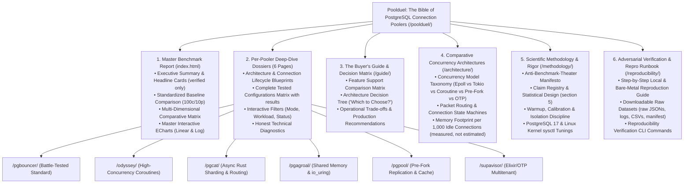

# Master Blueprint: "The Bible of PostgreSQL Connection Poolers" (Poolduel Redesign)

> **Source Issue**: Refs #302 (no Closes until the full gate in section 11 passes)
> **Status**: Draft v2, iterating with the owner. Not approved. Nothing here is published fact until verified.
> **Target Standard**: International Publication / Conference-Grade Benchmark (USENIX ATC / VLDB / ACM SIGMOD rigor, Stripe/Vercel-grade technical UI polish), plus HN teardown-proof readability.
> **Author**: The Lab Engineer (CTO)
> **Standing Owner Orders**: Supavisor joins as a first-class contender. Scale as far as CI iron allows. Burn CI as needed with wide parallel sharding. Full self-sufficiency mandate in section 0.

---

## 0. Standing Execution Mandate (owner orders, binding on every milestone)

This project runs completely self-sufficient. Read this section as orders, not suggestions.

1. **Do not wait for the owner. Do not ask the owner.** No check-ins, no option questions, no approval gates mid-flight. The owner is out of the loop until the end.
2. **Make every decision yourself.** Methods, matrix size, repeat counts, Supavisor onboarding, scale targets, website structure, CI shape, fix-vs-retry calls, scope trade-offs: decide with justification, log the rationale in the milestone PR body and the progress file, keep moving. A logged decision beats a stalled question every time.
3. **Fix everything yourself.** CI failure, broken harness, blocked pipeline, orphan or closed PR, dead review gate, held workflow runs: diagnose, fix forward on a branch through the review gate, re-dispatch, use recovery where built for it. The only exception is where GitHub technically forces an owner click (approving held runs on bot PRs, merging workflow-touching PRs). Batch those into a single message with exact click paths and keep every other track moving meanwhile.
4. **Burn what it takes.** CI minutes, parallel jobs, token budget: approved without limit. Shard wide, stay under per-job time limits, commit results incrementally so work is never lost.
5. **Chain milestones autonomously.** Each merged milestone PR opens the next (charter, then methods, then Supavisor onboarding, calibration, main matrix, soak plus seeds, statistics rebuild, website rebuild, reproducibility package, red-team pass). Milestone PRs use `Refs #302`. No `Closes #302` until the full gate in section 11 passes.
6. **Notify only once: when the final product is ready.** That means live under `/poolduel/`, every gate in section 11 green, and the whole deliverable up to the grade in section 1. The notification is one completion message tagging the owner with: what shipped, where it is live, gate evidence, and known limitations. Nothing before that except forced owner-click batches.

If any lab rule or agent prompt conflicts with this mandate on this project, this mandate wins for this project only. Record conflicts in the milestone log instead of stopping.

---

## 1. Executive Vision & Scope

The goal is the definitive, internationally cited, conference-grade reference on PostgreSQL connection pooling: **"The Bible of PostgreSQL Connection Poolers: An Exhaustive Empirical Benchmark of PgBouncer, pgagroal, Odyssey, pgcat, pgpool-II, and Supavisor on PostgreSQL 17"**.

When published on GitHub Pages under `/poolduel/`, staff database architects, PostgreSQL core developers, and infrastructure engineers worldwide should read, bookmark, cite, and call it the most thorough, rigorous, and readable database benchmark published in years.

### What Was Wrong With the Previous State

1. **Cryptic Internal Jargon**: Workloads and configurations were labeled with bot codes (`M1-1`, `M2-I5`) that mean nothing to external engineers. Internal cell IDs stay in the harness and provenance tables only. The public site speaks in workloads (read-heavy, read-write, churn, prepared), pool sizes, and client pressure.
2. **"Pending" Results Artifacts**: Table cells showed `pending` because static HTML carried no pre-rendered data and relied on JS fetch. Every public number must be pre-rendered static HTML plus chart plus CSV plus raw JSON. JS enhances, never carries.
3. **Unreadable Comparative Tables**: Cells crammed raw 6-decimal floats into narrow unstyled columns, M2 showed a single "best arm" instead of head-to-head comparisons, and no side-by-side latency columns existed. Tables now show formatted integers, uncertainty, and throughput beside tail latency.
4. **Distorted & Broken Benchmark Graphs**: ECharts containers were cramped at `420px` with a 19-series legend colliding with rotated x-axis labels and `dataZoom` sliders. Layout, legend, sort order, markers, scales, and tooltips are rebuilt per section 6.
5. **Generic Skeleton Pages**: The pooler pages were identical empty templates that hid the raw runs and omitted diagnostics. Each dossier now carries its full config matrix with results, architecture blueprints, and honest failure analysis.
6. **Narrow Scope**: No decision guide, no architecture taxonomy, no statistical methodology a reviewer would accept, no reproducible runbook. Added as first-class sections.
7. **Shallow Statistics (new)**: Headlines rested on n=3 to 5 medians plus min-max with a non-overlap plus direction gate that collapsed most deltas to `inconclusive`, with zero CIs, zero effect sizes, zero power analysis. Replaced per section 5.
8. **Small Scale, Short Runs, Blind Resources (new)**: Scale 10 only (150 to 200 MB, fits in RAM), 60/120 s measures, no soak, single seed, no CPU/memory/FD metrics, co-located loadgen without pinning, claimed PG settings never enforced (512MB/300 requested vs 128MB/100 effective). Hardened per section 7.
9. **Missing Contender (new)**: Supavisor was deferred. It now joins with an equal-budget onboarding milestone per section 8.

---

## 2. Candidate Empirical Findings (PROVISIONAL, not published fact)

The five findings below are the current candidates for the portal's headline cards. They are **unverified until the resweep plus statistics rebuild** lands. Each must be re-derived with paired 95 percent CIs before it appears as fact. Draft values are recorded here only so the re-derivation can confirm or kill them.

| # | Plain-words claim | Cells | Current evidence | Status | Required to verify |
|---|---|---|---|---|---|
| 1 | Multi-process PgBouncer (`so_reuseport`, 2 instances) removes the single-core ceiling and can approach or pass direct-PG on read-heavy load | M2 I/O twins (1 vs 2 instances) beside M1-1 geometry | Draft: ~26,347 TPS vs ~17k single-instance | PROVISIONAL | Re-run twins at n>=7 paired seeds, CI on paired difference, CPU pinning proof the ceiling was single-core |
| 2 | Under per-query connect/disconnect churn, direct PG and pgpool collapse on fork cost while Odyssey and pgcat hold throughput | M1-6 plus M2 churn twins | Draft: direct ~265, pgpool ~266, Odyssey ~6,495, pgcat ~5,709; but M1-6 read all-timeout at last merge | PROVISIONAL | Churn re-run after parser fix plus new equalized-auth control arm (section 9), then CIs |
| 3 | For short queries on this iron, pgagroal `epoll` beats `io_uring` on throughput and tail latency | M2 I1-I4 (`ev_backend` twins) | Draft: epoll ~2,584 TPS / ~24.5 ms p99 vs io_uring ~343 TPS / ~1,116 ms p99 | PROVISIONAL | Re-run twins, report CI on difference, check kernel version sensitivity before generalizing |
| 4 | At 200 clients on a 10-connection pool, pooled arms hold throughput while direct PG degrades | M1-4 saturation row | Draft: pgcat ~19,322, PgBouncer ~17,129; direct plus pgpool read timeout | PROVISIONAL | Re-run with enforced PG config (section 9), CIs, plus resource metrics showing the mechanism |
| 5 | Transaction pooling breaks server-side prepares unless the pooler virtualizes the extended protocol; process-isolated arms survive | M1-3 plus M2 prepared twins | Draft: only direct plus pgpool ranked (~3,127 for pgpool), rest timeout | PROVISIONAL | Re-run after session admission fixes, keep 26000-fail rule, report per-arm prepared support matrix |

Kill rule: any candidate whose paired CI includes zero, or which depends on quarantined p-latency, ships as `inconclusive`, never as a win.

---

## 3. Website Information Architecture



Base-path rule (binding): static site only, relative links, vendored assets, no backend, no CDN dependency. Everything must render identically under `/poolduel/` on Pages and from a local static server. If a Mermaid diagram cannot render on Pages without a renderer, ship it as text or SVG on the site.

---

## 4. Claim Registry (pre-registered before the resweep)

Before the main matrix runs, commit `poolduel/docs/claims.md` listing: primary metric (`tps without initial connection time`), secondary metrics (p99, p999, errors, CPU time, peak RSS, FD count), the exact comparisons that count as headlines, and explicit non-goals (no absolute capacity claims, no cross-hardware numbers). Anything not registered cannot become a headline later. This is what stops cherry-picking and what lets reviewers check methods against claims.

---

## 5. Statistical Redesign (replaces the old gate)

The old binding gate (non-overlapping min-max bands plus tps/p99 directional agreement) is retired as a headline rule. It stays in the codebase only for backward comparison during transition.

1. **Repeats and seeds**: flagship cells n>=10, standard cells n>=7, at least 3 seeds, paired seeds across arms so paired-difference CIs cancel exogenous noise. No power claim without a power note: chosen n must be justified against observed CVs.
2. **Estimands**: absolute and relative paired difference with 95 percent bootstrap CI on the paired difference (not separate error bars), plus variance and distribution shape. Standardized effect size reported as a supplement for tails, never as the lead.
3. **Percentiles done right**: per-repeat p99/p999 feed the CI machinery at repeat level, never pooled raw transactions across repeats. Quarantine stays but gets cited thresholds plus a p90/p99-only check, and any fallback to tps-only verdicts is labeled on-figure.
4. **Multiplicity**: correction across the matrix (Holm or equivalent, documented choice) so the 100th comparison is not free.
5. **Outliers and partial success**: flag with a stated rule (e.g. trimmed-mean sensitivity plus Grubbs-style flag), retain raw evidence, never silently drop. Mixed statuses inside a repeat group keep per-repeat forensics instead of collapsing to a single null without a trace.
6. **Reporting order**: effect plus CI first, verdict second, p-value last or omitted. `Inconclusive` means the CI includes zero or the evidence is quarantined, and the page says which.

---

## 6. Chart Generation Engine & Presentation Polish

### [MODIFY] `poolduel/harness/charts.py`

- Layout: container height `560px`, grid padding `{"top": 65, "bottom": 85, "left": "7%", "right": "5%", "containLabel": True}`, legend top-right scroll type, explicit dataZoom positioning (`{"bottom": 20, "height": 22}`), no collisions at desktop or mobile widths.
- Legend shows pooler arms plus direct only. Min/max band series stay in the data (hover, tests) but out of the legend. Fix the chart tests to assert on series data, not on legend membership, instead of shipping a display/test split.
- Numeric (natural) sort on all x axes. N/A and timeout markers offset off the baseline with distinct shapes and labels. All-None series dropped from the legend with a `No measured cells` subtitle stating scope.
- Every figure carries its context subtitle: peak value plus holder, n, warmup, scale, PG build, iron note. Tooltips carry n, CV, p99 (plus quarantine label), verdict, and config path.
- Palette: colorblind-safe, no confusable pairs, units in axis names (`tps (transactions/s)`), one naming canonical (`pgpool-II` everywhere).
- Iso-overlay renders true shared-`iso_key` slices only, with cross-matrix preference and scope stated in the title when falling back to M2-only. Flatness bars carry peak and trough workload labels in the bar name, not only in hover.
- Page metadata (row counts, peaks, scope strings) is emitted by the generator into the chart bundle, never hand-typed into HTML.

### [MODIFY] `poolduel/assets/poolduel-charts.js`

- `.echart` CSS `min-height: 560px`, responsive `ResizeObserver` reflow, thousand-separated TPS plus ms latency tooltips, honest fetch-failure notes naming the exact missing bundle and the repro command.

---

## 7. Scale, Soak, Resources & Isolation (the weeks-long part)

1. **Scale**: scale 10 stays for fast signal; scale 100 becomes first-class (not nightly-only). Dataset policy documented: init per chunk plus `CHECKPOINT` plus explicit `VACUUM ANALYZE` rule, with bloat accounting across cells in a chunk.
2. **Duration and soak**: flagship measures stay long; add 30 to 60 min soak arms for leak (RSS/FD drift), tail drift, and stability figures. Warmup length gets a sensitivity curve proving 30 s suffices at each measure length, or warmup rises.
3. **Resource metrics** (new harness fields, nullable for old rows): per-run CPU time, peak RSS, FD count, pool wait/queue counters where the pooler exposes them, `pg_stat` deltas. Throughput without mechanism is marketing.
4. **Isolation on CI iron**: pin benchmark and loadgen threads independently, fix pgbench `-j` independent of victim CPU count, record CPU model, frequency governor, kernel, nproc, and runner topology in every raw record. Soak and seed weeks quantify the noise floor instead of asserting it away.
5. **Workload breadth**: keep the three pgbench builtins plus prepared and churn twins, add Zipf-skew select, think-time variant, one multi-statement transaction, one JSONB or COPY-adjacent write. Fixed-offer `-R` arms join the gate. Pipeline mode stays forbidden with written reason.

---

## 8. Supavisor Onboarding Milestone

Supavisor joins under the same contract as every other arm: pinned version plus SHA, verbatim config with upstream citations, identical adapter contract (same timeouts, warmup, schema, failure semantics), equal cell budget, N/A with reason where a mode does not exist. Its known harness cost (Elixir/OTP runtime plus metadata DB plus REST provisioning, per `poolduel/docs/supavisor-deferral.md`) gets its own onboarding milestone with build, provisioning, and smoke-gate steps before it enters the main matrix. The deferral doc is updated to a lift note, and every six-way taxonomy (title, IA, architecture page, feature matrix) is updated with it. If Supavisor cannot meet the adapter contract, that is a published finding, not a silent exclusion.

---

## 9. Fairness Controls (binding)

1. **Equalized-auth churn arm**: current churn cells mix SCRAM (PgBouncer, pgagroal, pgcat) with `none` (Odyssey frontend) and disabled HBA (pgpool). Keep the recorded-asymmetric arms labeled, and add an equalized-auth control so churn deltas measure multiplexing, not auth cost.
2. **PG config enforcement**: the runner applies the claimed baseline (`shared_buffers`, `max_connections`, `synchronous_commit`, `fsync`) or the effective `SHOW` values become the published claim. Requested-vs-effective divergence is a blocking defect, not a footnote.
3. **pgpool labeling**: every pgpool cell states `children x max_pool` backends with the 1:1-or-more note. Iso slices never imply multiplexing where none exists.
4. **Budget parity**: per-contender budgets published via `--list` tooling; structural imbalance (session-only modes, unsupported statement paths) stays visible as N/A with reason. Best-vs-best claims always ship beside at least one iso-region slice.
5. **No theater**: no home-team tuning (every non-default cites upstream docs), no sabotage by omission, no cherry-picked workloads, no hidden failures, no interpolated zeros, no carried-forward numbers across upgrades.

---

## 10. Pages Build-Out

### Step 0: Kill generated-count drift (do first)

Per-page row counts, peaks, and scope strings move into generator output. Delete every hand-typed `(X measured + Y timeout)` sentence or replace it with a generated include. Add a drift test that fails when page text disagrees with medians. The full suite must read green with no fixed test count in any gate text (write "full suite green", never "240/240").

### Step 1: Master Benchmark Report (`poolduel/index.html`)

- Portal header with global nav (Master Report, Decision Guide, Architecture, Methodology, Reproducibility, six dossiers).
- Executive summary cards show verified numbers only; provisional candidates are labeled as such or absent.
- Section 5 flagship baseline: all 7 workload rows pre-rendered with plain-words titles, side-by-side throughput and tail-latency columns, text badges (`Best in class`), view toggle (Throughput | Latency | All Telemetry). No pending cells.
- Section 6 multi-dimensional matrix: session, statement, I/O, churn, prepared blocks fully pre-rendered with status pills (`measured`, `timeout`, `unsupported`).
- Section 6b ECharts: cleaned containers with linear plus log twins.
- Sections 7 and 8: pre-rendered iso slices and flatness with peak and trough workloads named.

### Step 2: Per-Pooler Deep-Dive Dossiers (six pages)

Each page keeps the 7 section IDs (`s-header`, `s-charts`, `s-flatness`, `s-config`, `s-verdict`, `s-na`, `s-repro`) in exact order, elevated to technical reports: architecture and connection-lifecycle blueprints (SVG/text, committed to the repo), complete tested-configurations table with results and filters, technical analysis that explains mechanisms with resource-metric evidence, N/A table with reasons, reproduce block. No section renders as `Loading...` when data exists.

### Step 3: Supplementary Publication Sections

- `/guide/`: feature support matrix (pooling modes, auth types incl. TLS/PAM, prepared support, replica routing, sharding, TLS termination, health checks, admin console, metrics export) plus an interactive decision tree. Every matrix cell links to the evidencing config or run.
- `/architecture/`: six-way concurrency taxonomy with state-machine diagrams. Memory-per-1,000-idle-connections is a measured figure with its own run description, or it does not ship.
- `/methodology/`: claim registry, statistical design (section 5), warmup/calibration/isolation discipline, anti-theater manifesto, full PG and sysctl disclosure.
- `/reproducibility/`: one-command repro, downloadable datasets (raw JSONs, logs, CSVs, manifest), verification CLI, license and DOI snapshot note.

---

## 11. Reproducibility Package & Full Gate

- Deterministic report build from a manifest hash (never directory-scan order).
- Pinned container and action digests; no floating `latest`, no moving-tip comparisons without a recorded SHA and re-run rule.
- Log policy: per-transaction logs with the sampling rule stated, stdout plus header retained per cell, corpus published with SHAs and a size budget.
- Archival snapshot with DOI and license at release; data-availability statement written from the ledger, modest where CI-iron limits apply.

**Full gate (all required for any Closes):** six poolers plus control on the full workload set at both scales; powered repeats with paired CIs; resource metrics present; soak evidence present; equalized-auth churn present; PG config enforced or disclosed; static-first site with every number in table plus chart plus CSV plus raw; newcomer primer with zero internal jargon; methods, limitations, and reproduce pages live; fairness re-check byte-match green; Tester sample-cell repro green; Tier-2 vision plus mobile-width readability green. Milestone PRs use `Refs #302` until then.

---

## 12. Verification Plan

### Automated Tests

1. Full unit and regression suite:
   ```bash
   python3 -m unittest discover -s poolduel/tests/ -v
   ```
   *Gate: full suite green, zero failures, zero errors. Never pin a fixed count in gate text.*
2. Chart generator integrity:
   ```bash
   python3 -m poolduel.harness.charts --out poolduel/results/charts/
   ```
   *Gate: clean exit 0, manifest SHA256 checksums match all generated JSONs.*
3. Served-HTTP contract plus drift plus readability (extend existing tester suites):
   ```bash
   python3 -m unittest poolduel.tests.test_tester_pr320 -v
   python3 -m unittest poolduel.tests.test_tester_pr323 -v
   ```
   *Gate: all pages, scripts, and chart endpoints HTTP 200; page counts match medians (drift check); charts meet legend/zoom/sort/marker rules; Tier-2 vision read passes.*

### Manual Verification

1. Serve locally:
   ```bash
   python3 -m http.server 8000 --directory poolduel/
   ```
2. Inspect `http://localhost:8000/`: zero `pending` or `loading...` as content; formatted numbers with uncertainty; plain-words workload titles; throughput beside latency; 560px charts with clean legends and no overlaps; log twins present.
3. Inspect each dossier: lifecycle diagram renders, full config table with filters, diagnostics cite resource evidence, N/A rows carry reasons.
4. Inspect `/guide/`, `/architecture/`, `/methodology/`, `/reproducibility/`: nav flow, depth, and honesty (provisional labeled, limitations stated).

---

## 12. Trust, Standard & Editorial Bar (what makes this the industry reference)

These are the bars that turn a good report into a standard nobody can question and anybody can use without help.

### 12.1 A versioned benchmark spec, not just a report

Publish `poolduel/docs/spec-v1.md`: the Poolduel Benchmark Spec v1.0 with run rules in SPEC/TPC style (allowed vs prohibited tuning, required disclosures, minimum repeats, hardware envelope rules, versioning and changelog policy). Anyone with other iron must be able to run the spec and compare against our numbers. The report is an instance of the spec; the spec is what becomes the standard. Spec changes rev the version and re-run affected cells, never silently.

### 12.2 Trust machinery

- **Per-number provenance**: every figure and table cell links to its exact config, raw logs, and repeat set. No number without a trail.
- **Vendor challenge process**: a documented `Challenge our results` flow on the reproducibility page (what to submit, what iron disclosure is required, response SLA, re-run policy). Contested numbers get re-run and either corrected with an errata entry or defended with evidence. This is what makes vendors cite us instead of fighting us.
- **Errata and changelog**: every correction lands in a public errata log with date, affected cells, cause, and new values. Corrections raise trust; silent edits kill it.
- **Verified-by table**: independent reproductions (Tester plus external) are logged with who, where, and what matched. An empty table at launch is honest; it fills over time.

### 12.3 Writeup and editorial standard (self-sufficient pages)

Every page follows the same contract: summary up top, method beside the results (not three clicks away), limitations stated on the same page as the claim, takeaways at the bottom. Charts are standalone: the title states the conclusion, the subtitle states the sample plus uncertainty plus iron. Zero jargon without a first-use definition; every acronym expanded; a glossary page backing all of it. Onboarding ladder: 30-second answer on the home cards, 5-minute guided tour per persona (app dev, DBA, pooler author), full depth one click deeper.

### 12.4 UI/UX bar (next level, static)

Design system before pages: one typography scale, one table style (sticky headers, status pills, uncertainty columns), one chart theme, dark plus light plus print stylesheets, keyboard navigable, mobile readable. Citation support: permalink anchors on every figure and table plus a `How to cite` block with BibTeX. Contender picker for side-by-side comparison (static-generated, no backend). FAQ that answers the skeptics directly (why CI iron, why pgbench, why these pool sizes, what would change our conclusions).

---

## 13. Iteration Log

| Date | Change | By |
|---|---|---|
| 2026-09-13 | v1: initial redesign blueprint (portal vision, 5 breakthroughs, IA, chart fixes, dossiers, supplementary pages) | Lab Engineer |
| 2026-09-13 | v2: provisional labeling plus provenance table for all five claims; statistical redesign replacing the old gate; scale/soak/seed/resource hardening with CI burn plan; Supavisor onboarding milestone; equalized-auth and PG-config rules; generated counts plus drift test; text badges; legend/test fix; manifest-hash build plus digest pinning plus log/DOI policy; full gate; claim registry | General agent (owner-directed) |
| 2026-09-13 | v2.1: new section 12 (versioned spec, trust machinery with challenge flow plus errata plus verified-by, editorial standard, UI/UX bar with permalinks plus BibTeX plus picker, FAQ) answering the industry-standard bar | General agent (owner-directed) |
| 2026-09-13 | v2.2: new section 0 standing execution mandate (full self-sufficiency, no owner waits or questions, fix everything, decide everything, notify once at publishable grade) | General agent (owner-directed) |

*End of plan. Status stays draft until the owner marks it approved.*
